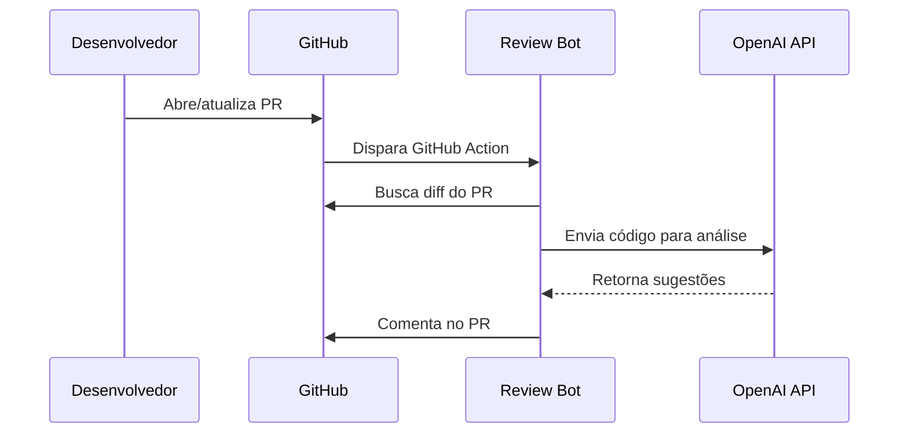

# AI Code Review Bot 🤖

Bot automático que faz code review em Pull Requests usando LLM

## Como funciona



1. Você abre (ou atualiza) um PR no repositório
2. O GitHub Action dispara automaticamente
3. O bot pega o diff e envia para o `gpt-5-nano` via OpenAI API
4. O modelo analisa o código e retorna sugestões
5. O bot posta a review como comentário no PR

## Features

✅ Review completa (bugs, performance, segurança)  
✅ Mostra custo real da review ($0.00X)  
✅ Sugere melhorias com exemplos de código  
✅ Identifica code smells e anti-patterns  
✅ Review em Português (PT-BR)  
✅ Zero config — só adicionar 1 secret

## Setup rápido

### 1. Fork ou clone este repositório

```bash
git clone https://github.com/fagnersouza666/ai-code-review-bot.git
```

### 2. Criar conta e chave na OpenAI

1. Acesse [platform.openai.com](https://platform.openai.com)
2. Crie uma conta (se ainda não tiver)
3. Vá em **API Keys** → **Create new secret key**
4. Copie a chave gerada (formato `sk-...`)

### 3. Configurar secret no GitHub

No seu repositório, vá em:

**Settings → Secrets and variables → Actions → New repository secret**

| Secret | Valor | Obrigatório |
|--------|-------|:-----------:|
| `OPENAI_API_KEY` | Sua chave da OpenAI (`sk-...`) | ✅ |

> **Nota:** O `GITHUB_TOKEN` é gerado automaticamente pelo GitHub Actions, não precisa configurar.

### 4. Ativar GitHub Actions

Vá em **Actions → Enable workflows** (se necessário).

### 5. Pronto! 🎉

Abra um Pull Request e o bot comentará automaticamente com a review.

## Teste local

Crie um arquivo `.env` baseado no `.env.example`:

```bash
cp .env.example .env
# Edite o .env com sua OPENAI_API_KEY
```

Execute o teste local:

```bash
pip install -r requirements.txt
./test_local.sh
```

O script vai pedir o repositório e número do PR para analisar.

## Configuração avançada

Edite `.github/workflows/review.yml` para customizar:

| Parâmetro | Default | Descrição |
|-----------|---------|-----------|
| `MODEL` | `gpt-5-nano` | Modelo OpenAI a usar |
| `max_output_tokens` | `16000` | Limite de tokens (inclui raciocínio) |

> **Importante:** O `gpt-5-nano` é um modelo de raciocínio. Ele usa parte dos tokens para "pensar" antes de gerar a resposta, por isso o `max_output_tokens` precisa ser alto o suficiente.

## Custos estimados

| Tipo de PR | Tokens (input) | Tokens (output) | Custo |
|-----------|:---------:|:---------:|:------:|
| PR pequeno (~50 linhas) | ~1k | ~1.5k | ~$0.0007 |
| PR médio (~200 linhas) | ~2k | ~2k | ~$0.001 |
| PR grande (~500 linhas) | ~5k | ~3k | ~$0.002 |

**Preços do gpt-5-nano:**
- Input: $0.10 / 1M tokens
- Output: $0.40 / 1M tokens

## Exemplo de review

```markdown
## 🤖 AI Code Review

### ✅ Pontos positivos
- Código bem estruturado
- Testes unitários presentes

### ⚠️ Sugestões

**1. Possível SQL Injection (linha 42)**
# ❌ Evite
query = f"SELECT * FROM users WHERE id = {user_id}"

# ✅ Use
query = "SELECT * FROM users WHERE id = %s"
cursor.execute(query, (user_id,))

**2. Performance (linha 87)**
Considere usar `set()` em vez de `list` para lookups (O(1) vs O(n))

---
**Custo desta review:** $0.0008
*Powered by gpt-5-nano | @Fagner_Souza*
```

## Stack

- **Python 3.10+**
- **OpenAI API** — SDK oficial com Responses API
- **PyGithub** — Interação com GitHub API
- **GitHub Actions** — CI/CD automatizado

## Estrutura do projeto

```
ai-code-review-bot/
├── src/
│   └── review_bot.py        # Bot principal
├── .github/
│   └── workflows/
│       └── review.yml        # GitHub Action
├── .env.example              # Exemplo de variáveis de ambiente
├── requirements.txt          # Dependências Python
├── test_local.sh             # Script para teste local
└── README.md
```

## Licença

MIT
